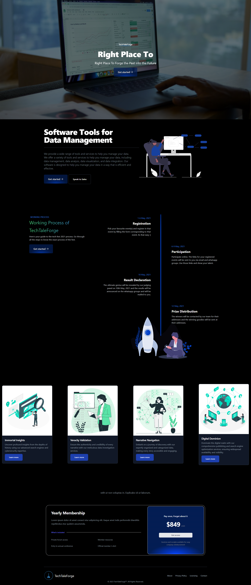

# DMS.com - Data Management Solutions

Welcome to DMS.com, an elegant design for a Data Management Company. This project is built using React, and provides a modern and responsive user interface.

## Features

- Beautifully designed components
- Responsive design that looks great on any device
- Interactive elements for a great user experience

## Design



## Getting Started

To get a local copy up and running, follow these steps:

1. Clone the repository:


2. Install the dependencies:
```sh
yarn install
```

3. Start the development server:
```sh

yarn dev

OR

npm run dev
```


## Building

To build the app for production, run:

```sh
yarn build
```

This will create a `dist` directory with a production build of the app.

## Contributing

Contributions are what make the open source community such an amazing place to learn, inspire, and create. Any contributions you make are greatly appreciated.

## License

Distributed under the MIT License. See `LICENSE` for more information.

## Contact

Ibrahim Gamal - ibrahimg01897@email.com
